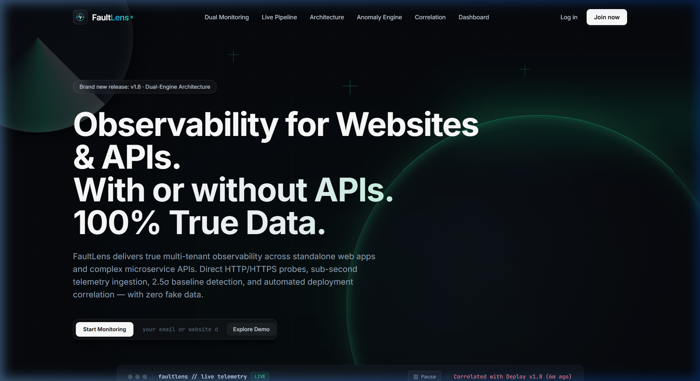
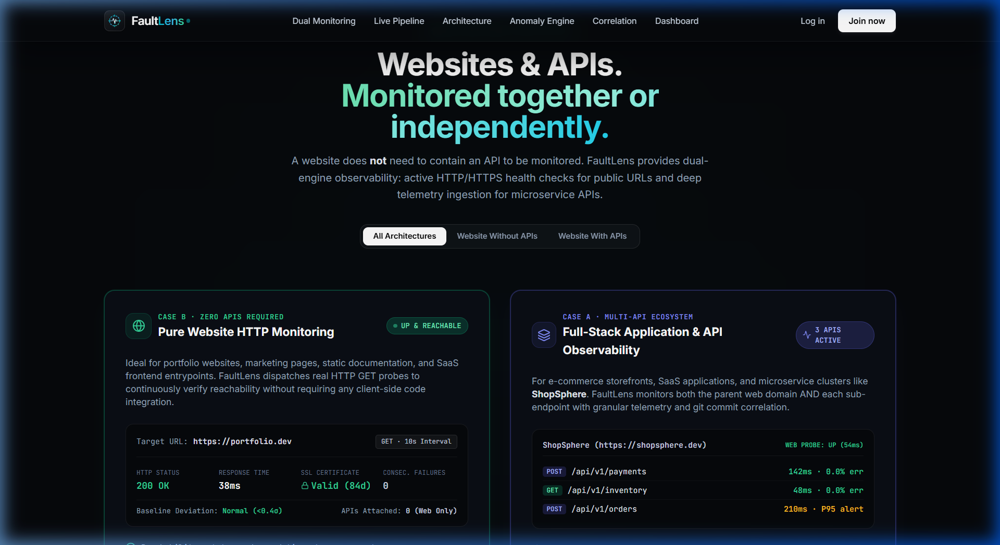
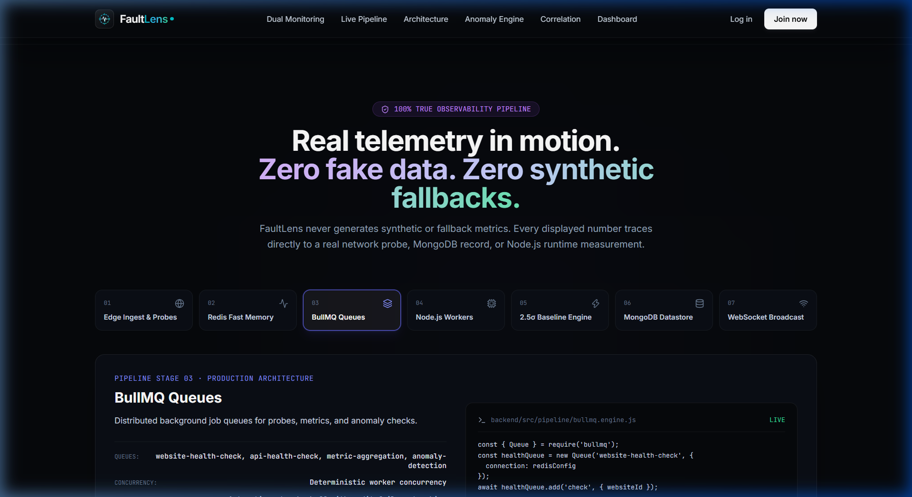
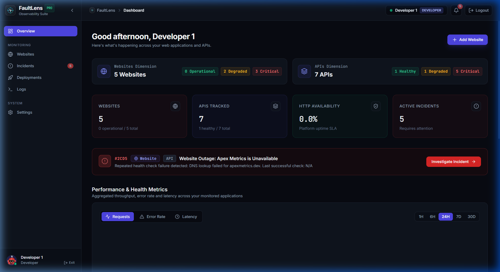
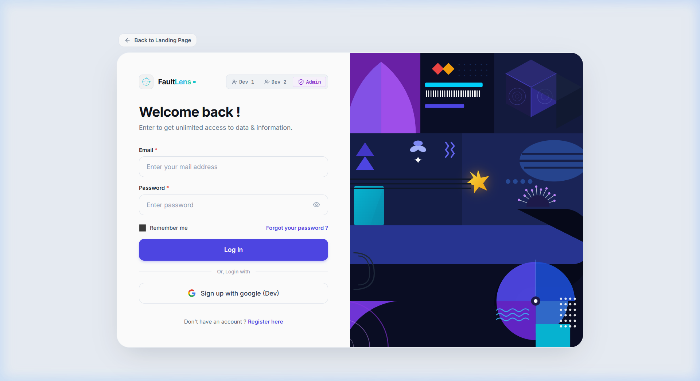
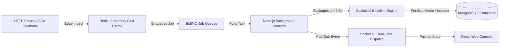

<div align="center">

# ⚡ FaultLens

**Developer-First Observability, API Monitoring & Incident Correlation Platform**

*Dual-engine monitoring for standalone websites and microservice APIs with 100% authentic data, dynamic 2.5σ statistical baselines, and temporal deployment correlation.*

[](https://nodejs.org/)
[](https://react.dev/)
[](https://www.mongodb.com/)
[](https://redis.io/)
[](https://bullmq.io/)
[](https://www.docker.com/)
[]()
[](LICENSE)

</div>

---

## 📸 Product Walkthrough

### 1. Observability for Websites & APIs
Dual-engine observability platform engineered for both standalone web applications and complex microservice clusters.



### 2. Dual Monitoring Architecture (Case A vs. Case B)
A website does **not** need an API to be monitored. FaultLens handles direct automated HTTP/HTTPS health checks for standalone websites and deep telemetry ingestion for microservice routes.



### 3. Live Infrastructure Event Pipeline
Real backend telemetry moving in real-time through Redis, BullMQ workers, the 2.5σ statistical baseline engine, MongoDB datastore, and WebSocket broadcasts.



### 4. Developer Console & Real-Time Performance
Per-developer isolated dashboard tracking request volumes, error rates, P50/P95/P99 latency percentiles, active incidents, and recent git releases.



### 5. Multi-Tenant Developer Authentication
Clean multi-tenant session isolation with quick-credential switchers for cross-tenant testing.



---

## 🏛️ Core Architectural Principles

### 1. Dual-Engine Monitoring Architecture
FaultLens recognizes that modern engineering ecosystems consist of two distinct types of web properties:

* **Case A: Websites with Microservice APIs** *(e.g., ShopSphere, FoodRush)*:
  * Websites serve as parent clusters aggregating multiple child API endpoints (`/api/v1/payments`, `/api/v1/orders`).
  * Combined health derivation: if any critical child API drops, the parent website health status degrades appropriately.
  * Ingests real-time latency percentiles (P50, P95, P99), HTTP status code distributions, and payload measurements.
* **Case B: Standalone Websites without APIs** *(e.g., Portfolios, Documentation, Marketing sites)*:
  * Zero APIs required.
  * Automated background HTTP/HTTPS GET probes continuously inspect endpoint reachability, response codes, timeout thresholds, and SSL/TLS certificate validity.
  * Standalone websites receive independent health monitoring, consecutive failure tracking, and automated outage incident creation.

---

### 2. Strict Multi-Tenant Isolation
FaultLens enforces cryptographic developer isolation across every resource layer:

$$\text{User / Developer} \longrightarrow \text{Website} \longrightarrow \text{Web Probes OR APIs} \longrightarrow \text{Metrics / Logs / Incidents / Deployments}$$

* **No Cross-Tenant Visibility**: Developers only have access to resources they own.
* **404 Resource Masking**: If Developer A queries an ID belonging to Developer B, the backend strictly returns `404 Not Found` rather than `403 Forbidden`, preventing resource enumeration or metadata leaks.
* **Role-Based Access Control (RBAC)**:
  * `DEVELOPER`: Scoped strictly to owned websites, APIs, metrics, and incident events.
  * `ADMIN`: Full platform visibility across all developer tenants, system health diagnostics, and user role management.

---

### 3. 100% True Observability (Data Authenticity Rule)
> **FaultLens never displays synthetic, placeholder, demo, or fallback monitoring data in production UI.**

* Every metric displayed is traceable to:
  1. A MongoDB record,
  2. A real HTTP synthetic probe measurement,
  3. Real Node.js runtime process telemetry, or
  4. Real Redis/BullMQ queue statistics.
* If no measurements exist for a resource, the UI renders the authentic zero-state:
  * `0` for count metrics,
  * `0%` for error rates with zero requests,
  * `—` for percentiles/latencies without recorded measurements,
  * `UNKNOWN` before the first active health probe completes,
  * Empty lists `[]` when no records exist.

---

### 4. Dynamic 2.5σ Statistical Baseline Engine
Static threshold alerts (e.g., `> 3000ms`) produce false alarms during normal traffic surges and fail to detect subtle regressions on fast APIs. FaultLens computes rolling statistical baselines:

$$\text{Threshold} = \mu + 2.5\sigma + \Delta_{\min} \quad (\Delta_{\min} = 50\text{ms})$$

* Calculated across the rolling 30 most recent checks.
* Automatically accommodates natural diurnal patterns while immediately flagging genuine latency anomalies.
* Consecutive failure triggers synthesize actionable incidents with full stack traces and status distributions.

---

### 5. Temporal Deployment Correlation
Connects incidents directly to git releases:
* Evaluates code changes within an active temporal change window (default: 60 minutes).
* Correlates performance spikes with recent commit hashes, commit messages, and deployment timestamps.
* Enables rapid rollback identification before minor regressions escalate into catastrophic platform outages.

---

## 🔄 Live Infrastructure Pipeline



---

## 🛠️ Technology Stack

| Layer | Technologies | Purpose |
| :--- | :--- | :--- |
| **Frontend** | React 19, Vite, TailwindCSS, Framer Motion | High-density developer observability interface |
| **Icons & Visuals** | Lucide React, Custom SVG Telemetry Logo | Sleek dark-mode aesthetic with cyan/emerald accents |
| **Backend API** | Node.js 22, Express, Mongoose 8 | RESTful multi-tenant microservice APIs |
| **Primary Database** | MongoDB 7.0 | Document store for users, websites, APIs, metrics, and incidents |
| **In-Memory & Queues** | Redis 7, BullMQ | Distributed task scheduling, probe queues, fast telemetry caching |
| **Real-Time Sync** | Socket.IO | Sub-second metric broadcasting and infrastructure event streaming |
| **Containerization** | Docker, Docker Compose, Nginx Alpine | Full-stack container orchestration |

---

## 🚀 Quick Start with Docker Compose

Run the complete FaultLens platform with a single command:

```bash
# Clone the repository
git clone https://github.com/Jeelkathiria/FaultLens.git
cd FaultLens

# Launch all 4 services (MongoDB, Redis, Backend, Frontend)
docker compose up --build -d
```

### Services Breakdown:
* **Frontend Web Console**: [http://localhost:5173](http://localhost:5173)
* **Backend REST API**: [http://localhost:5000](http://localhost:5000)
* **MongoDB Datastore**: `localhost:27017`
* **Redis In-Memory Engine**: `localhost:6379`

To stop the containers:
```bash
docker compose down
```

---

## 💻 Manual Local Development

### Prerequisites
* **Node.js**: v20.x or v22.x
* **npm**: v10.x+
* **MongoDB**: v6.0+ or v7.0 running locally on port `27017`
* **Redis**: v6.0+ or v7.0 running locally on port `6379`

### 1. Backend Setup
```bash
cd backend
npm install

# Copy environment variables
cp .env.example .env

# Start development server
npm run dev
```

### 2. Frontend Setup
```bash
# In the repository root
npm install

# Start Vite development server
npm run dev
```
Open [http://localhost:5173](http://localhost:5173) in your browser.

---

## 🔐 Multi-Tenant Test Credentials

The database initializes with two isolated developer accounts and one platform admin:

| Role | Email | Password | Scope & Accessible Resources |
| :--- | :--- | :--- | :--- |
| **Developer 1** | `developer@faultlens.dev` | `Developer@12345` | **ShopSphere** + **FoodRush** |
| **Developer 2** | `dev2@faultlens.dev` | `Developer@12345` | **TaskFlow** |
| **Admin** | `admin@faultlens.dev` | `Admin@12345` | **Global Platform** (All websites, users, infrastructure) |

*The login page includes one-click test credential switchers for instant verification.*

---

## 🧪 Verification & Automated Testing

FaultLens features an automated Jest test suite enforcing tenant boundaries, health check algorithms, and data authenticity rules.

```bash
cd backend
npm test
```

### Test Suite Summary:
* **`tests/auth.test.js`**: Authentication, JWT token verification, expired tokens, and registration.
* **`tests/isolation.test.js`**: Cross-tenant isolation across websites, APIs, metrics, incidents, deployments, and logs.
* **`tests/websiteMonitoring.test.js`**: Standalone website health probes, response times, and automated outage creation.
* **`tests/healthChecker.test.js`**: Synthetic HTTP probes, HTTP error handling, and timeout budgets.
* **`tests/apiCheckAuth.test.js`**: Token authorization on manual checks.
* **`tests/dataAuthenticity.test.js`**: Verification of zero synthetic fallback values.
* **`tests/incidents.test.js`**: Automated incident lifecycle, state engine, and event auditing.
* **`tests/correlation.test.js`**: Temporal commit linking to performance degradation.
* **`tests/infrastructure.test.js`**: Live infrastructure flow, BullMQ job inspection, and admin RBAC.

```text
Test Suites: 11 passed, 11 total
Tests:       86 passed, 86 total
Snapshots:   0 total
Time:        ~5.2s
```

---

## 📡 API Reference Overview

### Public & Authentication Endpoints
* `POST /api/v1/auth/register` — Register new developer account
* `POST /api/v1/auth/login` — Authenticate and receive JWT Bearer token
* `GET /api/v1/auth/me` — Retrieve current authenticated session

### Website & API Monitoring
* `GET /api/v1/websites` — List websites owned by authenticated developer
* `POST /api/v1/websites` — Register new website (with or without APIs)
* `GET /api/v1/websites/:id` — Get website details and real-time probe diagnostics
* `GET /api/v1/websites/:id/apis` — List child APIs belonging to website
* `POST /api/v1/websites/:id/apis` — Register new API endpoint under website
* `POST /api/v1/apis/:id/check` — Trigger manual synthetic health probe check

### Telemetry Ingestion
* `POST /api/v1/telemetry` — Ingest request metric payload (strictly verifies API Key ownership chain)

### Incidents & Deployments
* `GET /api/v1/incidents` — List active and resolved incidents for developer
* `GET /api/v1/incidents/:id` — Incident audit trail, status distributions, and error traces
* `POST /api/v1/deployments` — Record git release for temporal regression correlation
* `GET /api/v1/deployments` — List deployments within change window

### Platform Administration (Admin Role Only)
* `GET /api/v1/admin/users` — List platform users and roles
* `GET /api/v1/admin/system-health` — Overall platform process and queue statistics
* `GET /api/v1/admin/infrastructure` — Live infrastructure flow state and worker metrics
* `GET /api/v1/admin/infrastructure/queues/:name/jobs` — Inspect active and queued BullMQ jobs

---

## 📄 License

This project is licensed under the MIT License — see the [LICENSE](LICENSE) file for details.
